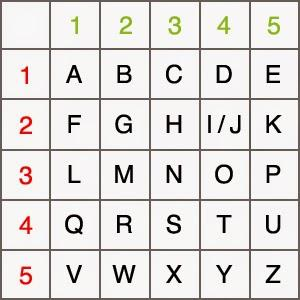
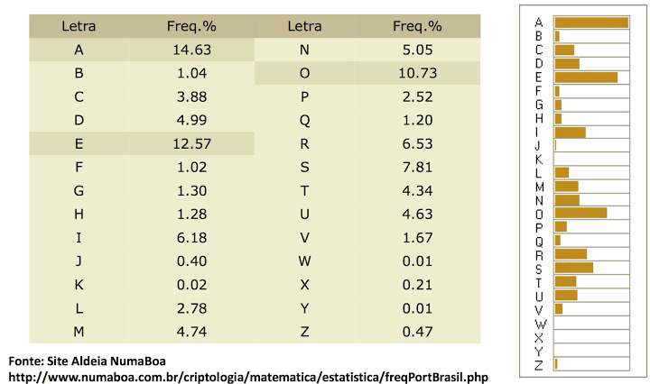
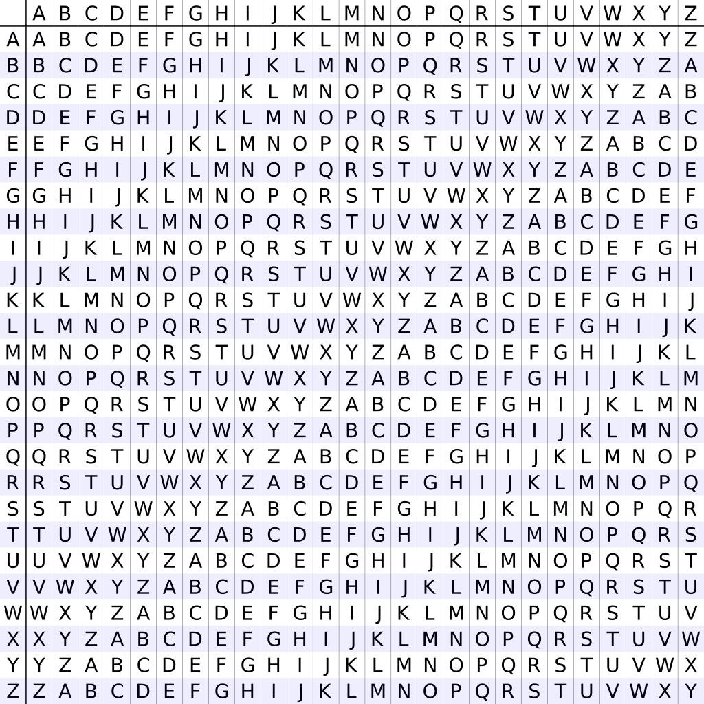

Criptografia 

Do latim cryptographia, formado de cript(o) - (kruptós 'oculto, secreto, obscuro, ininteligível') + -grafia (gr. -graphía, com o sentido de 'escrita'); É o conjunto de métodos e princípios da codificação da comunicação a fim de tornar a informação ininteligível para terceiros não autorizados.

Os métodos criptográficos desenvolvem-se conforme a necessidade e tecnologia disponível no período, durante a antiguidade as cifras limitavam-se a substituições e transposições e eram empregadas com diversas finalidades como enviar mensagens estratégicas em tempos de guerra, permitir a conversa entre dois amantes, guardar segredos comerciais ou simplesmente por estética. 

	

Em todo método criptográfico há sempre três fatores:

O texto plano, que é o texto a ser criptografado; *O domínio*.

	O método, que é a descrição do processo de criptografia; *A função*.

	O *texto cifrado*, que é o resultado do método aplicado ao texto plano; *Contradomínio.*  

Cifras de substituição

É uma forma de criptografia do qual os símbolos do alfabeto do texto plano são substituídas por símbolos do alfabeto do texto cifrado de acordo com uma regra de deslocamento. A forma de decriptação é a substituição inversa. 

Nas cifras em que a chave é o deslocamento, frequentemente temos um valor de deslocamento maior do que a quantidade de letras do alfabeto. Neste caso, utilizamos o conceito de módulo. Por exemplo, deslocamento de 29 em um alfabeto de 26 letras corresponde ao valor 29 mod 26, que resulta em um deslocamento de 3 letras.

Ex 1. [*Alfabetos não coincidentes*]

Alfabeto texto plano: 		A|*|C|D|&|F|%|$|I| (...)

Alfabeto texto cifrado: 	1|2|3|4|5|6|7|8|9| (...)

Ex 2. [*Alfabetos coincidentes*]  

	Alfabeto texto plano: 		A|B|2|D|4|F|5|H|I| (...)

Alfabeto texto cifrado: 	A|B|2|D|4|F|5|H|I| (...)

Monoalfabética ou simples

Cada unidade do texto plano é substituída por uma única unidade do texto cifrado em uma razão de deslocamento constante para todas unidades. 

  

**A**|B|C|D|**E**|F|**G**|**H**|I|J|K|L|M|**N**|O|P|Q|R|**S**|T|U|V|W|X|Y|Z|

**3**|4|E|F|**G**|H|**I**|**J**|K|L|M|N|O|**P**|Q|R|S|T|**U**|V|W|X|Y|Z|1|2|

*Deslocamento 2*

Ganesh -> I3pguj

Polialfabética

Cada unidade do texto plano é substituída por uma única unidade do texto cifrado em uma razão de deslocamento variável para pelos menos uma unidade. Comumente utiliza-se outra palavra (chave) para indicar o deslocamento de cada símbolo do texto plano.

Texto plano:  	O|X|I|N|T|A|

Cifra: 		G|A|N|E|S|H|

Texto cifrado:	U|X|V|R|L|H|

Um exemplo famoso é a cifra de Vigenere.

Homófona

Cada símbolo do alfabeto do texto plano é correspondida pra mais do que um símbolo. É utilizado para dificultar uma análise estatística baseada na frequência.

Alfabeto do texto plano:   		ABCDEFGHIJKLMNOPQRSTUVWXYZ

Alfabeto 1 do texto cifrado: 		1234EFGHIJKLMNOPQRSTUVWXYZ

Alfabeto 2 do texto cifrado: 		@#$ABCDEFGHIJKLMNOPQRSTUV

Alfabeto 3 do texto cifrado: 		ZWYKLMNSPQ234FDJV=-915678CX

Texto cifrado: ‘Cifra curta’ -> 3JGS1 $VSU@

Poligráfica

A substituição se dá mapeando um caractere para um grupo de símbolos. 

Alfabeto do texto plano:   A; B; C; E[...]

Alfabeto do texto cifrado: &A, 789; CVD; ZDFG[...]

Cifras de transposição

	É uma forma de criptografia do qual os símbolos do alfabeto do texto plano são permutados de acordo com uma regra, gerando o texto cifrado. A forma de decriptação é a permutação inversa. 

Diferenças de transposição e substituição

SUBSTITUIÇÃO - POSIÇÃO PRESERVADA, ALFABETO ALTERADO

TRANSPOSIÇÃO - POSIÇÃO ALTERADA, ALFABETO PRESERVADO

Ex.  

	Texto plano = 		Elefante 	

	Substituição = 		Fmfgborf

	Transposição = 	etnafelE

**Transposição por coluna:**

**	**Encriptação: escrevemos a chave na primeira linha da tabela e o texto plano nas linhas seguintes, em seguida, lemos o texto na vertical seguindo a ordem alfabética das letras da chave.

	Decriptação: escrevemos o texto cifrado na tabela na direção vertical seguindo a ordem alfabética das letras da chave (primeira linha), em seguida lemos o texto na horizontal na direção usual.

	**Exemplo:**

		Texto plano: Somos o Ganesh

		Chave: crivo

<table>
  <tr>
    <td>C</td>
    <td>R</td>
    <td>I</td>
    <td>V</td>
    <td>O</td>
  </tr>
  <tr>
    <td>S</td>
    <td>o</td>
    <td>m</td>
    <td>o</td>
    <td>s</td>
  </tr>
  <tr>
    <td></td>
    <td>o</td>
    <td></td>
    <td>G</td>
    <td>a</td>
  </tr>
  <tr>
    <td>n</td>
    <td>e</td>
    <td>s</td>
    <td>h</td>
    <td>_</td>
  </tr>
</table>

		Texto cifrado: S nm ssa_ooeoGh

**Como identificar cifras**

Nas cifras de substituição, ao substituirmos qualquer letra, há uma alta probabilidade de que a letra resultante seja uma consoante, pois há mais consoantes do que vogais em nosso alfabeto. Porém, a frequência de vogais nas palavras do português é próxima à de consoantes, apesar de existirem menos vogais no alfabeto. Portanto, conseguimos distinguir entre cifras de substituição e transposição. Se, no texto cifrado, aparecer muito mais consoantes do que vogais, concluímos que foi utilizada uma cifra de substituição; caso contrário, concluímos que foi utilizada uma cifra de transposição.

**Cifras da antiguidade.**

Atbash 

Uma das primeiras cifras de substituição. É vista em passagens da bíblia como em [Jeremias 25:26 - "O rei de Sheshach beberá depois deles" - Sheshach, que significa Babilônia em Atbash (בבל bbl → ששך ššk)]. 

	Trata-se de uma substituição monoalfabética de deslocamento 0 com o alfabeto do texto cifrado na ordem inversa do alfabeto do texto plano. Exemplo com o alfabeto latino:

A  |B |C |D |E |F |G |H |I  |J  |K |L |M |N |O |P |Q |R |S  |T |U |V |W |X |Y |Z

Z  |Y |X |W |V |U |T |S |R |Q |P |O |N |M |L |K |J  |I   |H |G |F |E |D |C |B |A

Ganesh -> Tzmvhs

Cifra de César

	Foi uma cifra de substituição monoalfabética utilizada pelo general Julio César em Roma. 

Exemplo com o alfabeto latino:

A|B|C|D|E|F|G|H|I|J|K|L|M|N|O|P|Q|R|S|T|U|V|W|X|Y|Z

C|D|E|F|G|H|I|J|K|L|M|N|O|P|Q|R|S|T|U|V|W|X|Y|Z|A|B

Deslocamento 2

Ganesh -> Icpguj

Polybius Square

Um dispositivo inventado por Cleoxenus e Democleitus e aperfeiçoado por Polybius, cujo propósito era dividir os símbolos do texto plano para que pudessem ser representados por um conjunto menor de símbolos. 

Inicialmente, Polybius sugeriu que os símbolos poderiam ser usados para transmitir mensagens com pares de tochas. Além disso, também foi usada na forma de "knock code" para transmitir mensagens em prisões a partir de barulhos em canos e paredes. 

A tabela a seguir é utilizada para encriptar e decriptar mensagens:

**Exemplo:**

Texto plano: 	G  |a |n |e |s |h |

Texto cifrado: 22|11|33|15|43|23|

Outras

Na Índia, há relatos de duas formas de cifras chamadas de Kautiliyam e Mulavediya. Na Kautiliyam, as substituições de letras da cifra são baseadas nas relações fonéticas, tais como vogais se tornando consoantes, e vice-versa. Na Mulavediya, o alfabeto da cifra consiste em pares de letras e a utilização de recíprocas.

**Medieval.**

Segundo David Kahn, a criptografia moderna teve origem com os árabes, que foram o primeiro povo a documentar sistematicamente métodos criptanalíticos. Al-Khalil (717-786) escreveu o primeiro livro com registros do primeiro uso de permutações e combinações para listar todas as possíveis palavras árabes com e sem vogais.

Textos cifrados feitos por uma cifra clássica podem revelar informações estatísticas sobre o plaintext, o que pode ser usado para quebrar a cifra usada. Com a descoberta da análise por frequência, pelo matemático árabe Al-Kindi no século IX, quase todas as cifras poderiam ser quebradas com métodos baseados nessa forma de análise. A frequência de uso de letras em um alfabeto, por exemplo, é uma forma de explorar a previsibilidade de tais cifras. 

Ex no alfabeto da língua portuguesa:

A análise de frequência foi uma forma eficiente de quebrar a proteção de mensagens até a criação das cifras polialfabéticas, sendo descrita pela primeira vez no trabalho de Al-Qalqashandi (1355–1418), baseado nos estudos de Ibn al-Durayhim (1312–1359), descrevendo uma cifra polialfabética na qual cada plaintext é relacionado com mais de um substituto. Também foi descrita por Leon Battista Alberti em, aproximadamente, 1467, sendo que ele também inventou o que, possivelmente, foi o primeiro dispositivo automático para gerar cifras.

A cifra de Vigenère

É uma cifra polialfabética cuja chave é uma palavra responsável por especificar o deslocamento, caractere a caractere, do texto cifrado.

Muitas pessoas tentaram quebrar a cifra, mas até 3 séculos depois de criada, ninguém havia obtido sucesso. No entanto, em 1863, Friedrich Kasiski foi o primeiro a publicar um método de ataque da cifra de Vigenère.

O ataque ocorre quando a chave é menor que o texto plano, ocasionando colisões (deslocamentos iguais) ao longo do texto cifrado, sendo plausível de análise criptográfica.

A tabela a seguir é utilizada para facilitar a encriptação e decriptação, dado um texto plano e uma chave.

**Exemplo:**

Texto:  SomosOGanesh

Chave: cripto

Encriptação: Para encriptar a primeira letra, olhamos a primeira linha e encontramos a coluna da letra S (do texto plano). Posteriormente, olhamos a primeira coluna e encontramos a linha da letra c (da chave). A primeira letra do texto cifrado será o cruzamento entre essa linha e essa coluna, com isso encontramos a letra U.

|S|o|m|o|s|O|G|a|n|e|s|h|

|c|r|i|p|t|o|c|r|i|p|t|o|

	Texto cifrado: UfudlCIrvtlv

	Decriptação: O processo é semelhante ao da encriptação, porém utilizando o texto cifrado e a chave.

A cifra AutoKey

	É uma melhoria da cifra de Vigenère de modo a garantir que a chave sempre tenha o mesmo tamanho do texto plano, a fim de prover maior segurança (com essa cifra não é possível realizar ataques estatísticos). Para isso, utilizamos uma palavra de C caracteres que será usada para compor o início da chave, sendo o restante da chave composta pelos primeiros N-C caracteres do texto plano (que possui tamanho N). 

	**Exemplo:**

	Texto: SomosOGanesh

	Palavra: Key

	Chave: KeySomosOGan

	Encriptação:

                   |S|o|m|o|s|O|G|a|n|e|s|h|

                   |K|e|y|S|o|m|o|s|O|G|a|n|

Texto cifrado:|C|s|k|g|g|A|U|s|b|k|s|u|

	Decriptação:

                 |C|s|k|g|g|A|U|s|b|k|s|u|

                 |K|e|y|[...]

     Texto plano:|S|o|m|[...]

	Tendo acesso às primeiras 3 letras do texto plano, podemos continuar preenchendo a chave a fim de decriptar o texto cifrado.

	

Cifras contemporâneas

Até o século XX, criptografia estava focada com linguística e padrões lexicográficos. Desde então, houve uma alteração na ênfase, pois, atualmente, criptografia utiliza de artifícios matemáticos para garantir a segurança de suas cifras, o que é possível devido ao grande desenvolvimento dos computadores, que são capazes realizar diversos processos em um curto intervalo de tempo. 

Além disso, também há pesquisas baseadas no relacionamento entre problemas criptográficos e física quântica.

**Esteganografia.**

**	**A esteganografia (do grego ‘escrita escondida’) é o uso de de técnicas para ocultar a existência de uma mensagem dentro da outra, uma forma de segurança por obscurantismo.
	A diferença entre esteganografia e criptografia é que a primeira preocupa-se em ocultar a existência da mensagem, e a segunda o seu significado.

Método NULL

A simples representação também remete à esteganografia, que é uma técnica para omitir uma mensagem dentro de outra, com o objeto de fazer com que uma forma escrita seja camuflada em outra a fim de mascarar sua própria existência. Uma técnica simples de esteganografia é o método NULL, no qual a letra do meio de cada palavra da mensagem original compõe a mensagem que se deseja esconder.

