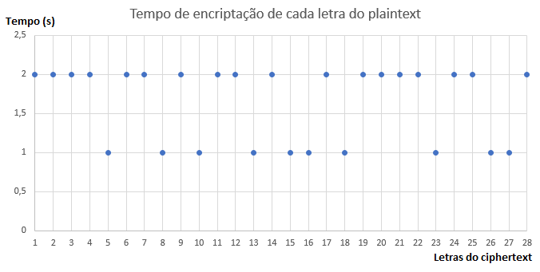
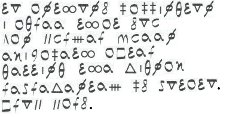
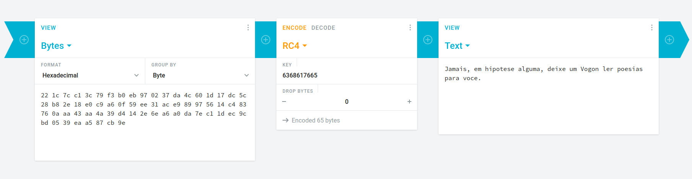

# Chall

## A luz sempre tem as respostas

A luz lhe diz tudo, basta confiar nela e então a mensagem se revela por si só.

Gibz spxiawih, d jfal ph meuksuemaoexmyqe.

### Dicas:

1. Auto, do gregos autós. Por si mesmo.

### Resolução:

O desafio consiste em usar a cifra AutoKey com a chave “luz”, a resposta é imediata e corresponde a:

Voce entendeu, a flag eh **ganeshautokeyomg**.

Basta então usar **ganeshautokeyomg** para completar o desafio.

## Hmmmm Bacon

00001 00000 00010 01101 01100 00100 00111 00001 01101 01011 00111 00100 01000 01100 00110 10011 10000 01000 10111 00000 00011 00000 00100 00000 00101 01010 00000 00110 00100 00111 00110 00000 01100 00100 10001 00111 10001 01101 10010 00100 01011 01010 01000 01100 00011 10101

### Resolução:

De início, percebemos que o enunciado é, na verdade, uma mensagem criptografada. Precisamos descobrir agora qual cifra foi utilizada para encriptar tal mensagem. Analisando o título, vemos que tem alguma relação com “Bacon”. Além disso, vemos que o ciphertext é dividido em seções de 5 símbolos, podendo apresentar o valor de 0 ou 1. Uma rápida busca no Google nos diz que essas são características da [Cifra de Bacon utilizando o alfabeto binário](https://en.wikipedia.org/wiki/Bacon%27s_cipher). Para decriptar, basta utilizarmos uma das seguintes tabelas:

| Letter | Code | Binary | Letter | Code | Binary |
| :--- | :--- | :--- | :--- | :--- | :--- |
| A | aaaaa | 00000 | N | abbaa | 01100 |
| B | aaaab | 00001 | O | abbab | 01101 |
| C | aaaba | 00010 | P | abbba | 01110 |
| D | aaabb | 00011 | Q | abbbb | 01111 |
| E | aabaa | 00100 | R | baaaa | 10000 |
| F | aabab | 00101 | S | baaab | 10001 |
| G | aabba | 00110 | T | baaba | 10010 |
| H | aabbb | 00111 | U, V | baabb | 10011 |
| I, J | abaaa | 01000 | W | babaa | 10100 |
| K | abaab | 01001 | X | babab | 10101 |
| L | ababa | 01010 | Y | babba | 10110 |
| M | ababb | 01011 | Z | babbb | 10111 |

| Letter | Code | Binary | Letter | Code | Binary |
| :--- | :--- | :--- | :--- | :--- | :--- |
| A | aaaaa | 00000 | N | abbab | 01101 |
| B | aaaab | 00001 | O | abbba | 01110 |
| C | aaaba | 00010 | P | abbbb | 01111 |
| D | aaabb | 00011 | Q | baaaa | 10000 |
| E | aabaa | 00100 | R | baaab | 10001 |
| F | aabab | 00101 | S | baaba | 10010 |
| G | aabba | 00110 | T | baabb | 10011 |
| H | aabbb | 00111 | U | babaa | 10100 |
| I | abaaa | 01000 | V | babab | 10101 |
| J | abaab | 01001 | W | babba | 10110 |
| K | ababa | 01010 | X | babbb | 10111 |
| L | ababb | 01011 | Y | bbaaa | 11000 |
| M | abbaa | 01100 | Z | bbaab | 11001 |

Com isso, decriptando a mensagem, encontramos: “baconehbomheingurizadaeaflagehganeshsotemlindx”. Portanto, a flag é **ganeshsotemlindx**.

## Pafuntilo, o Criptógrafo

Pafuntilo é o monge que vivia no templo das 9 colunas e sabe-se que além de criptógrafo ele amava o nome que tinha já que o usava para tudo codificar tudo. Ele deixou esta mensagem pra você:

aNNn5\_{13TT5s0UR1}G40h5LePR

### Dicas:

1. Dórica, Jônica, Coríntia, Toscana e Compósita

### Resolução:

Como o texto apresenta os caracteres “{” e “}”, que aparecem no formato de flag, inferimos que se trata de uma cifra de transposição. O desafio apresenta a dica “9 colunas” e também verificamos que o nome “Pafuntilo” possui 9 letras. A conclusão é que se trata portanto de uma cifra de transposição colunar cuja chave é “Pafuntilo”, a resposta é imediata e corresponde a:

**Ganesh{TR4N5P051T10N\_RUL35}**

## Terra média

Esta mensagem foi encontrada no meio dos trabalhos de um grande e conhecido escritor da língua inglesa, mas infelizmente está criptografada. A flag é o nome do ser ao qual a quarta linha se refere.

VALYY LXPFK SQL VAY YCRYP IXPFK BPUYL VAY KIE,  
 KYRYP SQL VAY UONLS CQLUK XP VAYXL ANCCK QS KVQPY,  
 PXPY SQL GQLVNC GYP, UQQGYU VQ UXY,  
 QPY SQL VAY UNLI CQLU QP AXK UNLI VALQPY  
 XP VAY CNPU QS GQLUQL OAYLY VAY KANUQOK CXY.  
 QPY LXPF VQ LBCY VAYG NCC, QPY LXPF VQ SXPU VAYG,  
 QPY LXPF VQ MLXPF VAYG NCC NPU XP VAY UNLIPYKK MXPU VAYG.  
 XP VAY CNPU QS GQLUQL OAYLY VAY KANUQOK CXY.

### Dicas:

1. One ring to rule them all…

### Resolução:

Pela dica \(escritor inglês\) inferimos que se trata de um fragmento de texto escrito em inglês e pelo tamanho das palavras inferimos que se trata de uma cifra de substituição simples, este chall se baseia então em descobrir o que cada caractere significa com tentativa e erro. Comparando a frequência de cada letra do texto com a frequência de letras da língua inglesa inferimos que a letra “Y” do texto deve corresponder à letra “e”, por ser a letra mais comum do alfabeto inglês. O texto passa a ter a forma:

VALee LXPFK SQL VAe eCReP IXPFK BPUeL VAe KIE,  
 KeReP SQL VAe UONLS CQLUK XP VAeXL ANCCK QS KVQPe,  
 PXPe SQL GQLVNC GeP, UQQGeU VQ UXe,  
 QPe SQL VAe UNLI CQLU QP AXK UNLI VALQPe  
 XP VAe CNPU QS GQLUQL OAeLe VAe KANUQOK CXe.  
 QPe LXPF VQ LBCe VAeG NCC, QPe LXPF VQ SXPU VAeG,  
 QPe LXPF VQ MLXPF VAeG NCC NPU XP VAe UNLIPeKK MXPU VAeG.  
 XP VAe CNPU QS GQLUQL OAeLe VAe KANUQOK CXe.

Vemos que logo a primeira palavra do texto termina com “ee”. Existem em torno de 40 palavras em inglês que terminam com “ee” porém poquíssimas delas são comumente usadas. Três destas palavras seriam “three”, “agree” e “melee”, todas as outras são muito mais incomuns quando comparadas às 3 listadas. Podemos descartar a palavra “melee” pois a letra “e” já foi substituída, se usarmos a palavra “agree” a palavra de 3 letras “VAe” se torna “age” e se usarmos “three” se torna “the”. Como é uma palavra de 3 letras que ocorre diversas vezes ao longo do texto é mais provável que se trate de “the” e com isso inferimos as seguintes relações: “V” = “t”, “A” = “h”, “L” = “r”. O texto se torna então:

three rXPFK SQr the eCReP IXPFK BPUer the KIE,  
 KeReP SQr the UONrS CQrUK XP theXr hNCCK QS KtQPe,  
 PXPe SQr GQrtNC GeP, UQQGeU tQ UXe,  
 QPe SQr the UNrI CQrU QP hXK UNrI thrQPe  
 XP the CNPU QS GQrUQr Ohere the KhNUQOK CXe.  
 QPe rXPF tQ rBCe theG NCC, QPe rXPF tQ SXPU theG,  
 QPe rXPF tQ MrXPF theG NCC NPU XP the UNrIPeKK MXPU theG.  
 XP the CNPU QS GQrUQr Ohere the KhNUQOK CXe.

Tendo descoberto estas 4 letras é possível inferir várias palavras caso haja familiaridade com a língua inglesa. Alguns exemplos seriam “SQr” = “for”, “QPe” = “one”, “Ohere” = “where”, “thrQPe” = “throne” etc. O texto final deve ser:

three rings for the elven kings under the sky,  
 seven for the dwarf lords in their halls of stone,  
 nine for mortal men doomed to die,  
 one for the dark lord on his dark throne  
 in the land of mordor where the shadows lie.  
 one ring to rule them all, one ring to find them,  
 one ring to bring them all and in the darkness bind them  
 in the land of mordor where the shadows lie.

Basta agora identificar que se trata da epígrafe de “O Senhor dos Anéis” e o escritor ao qual a dica se refere é J. R. R. Tolkien. O personagem referenciado na quarta linha “... dark lord ...” é Sauron, a flag que soluciona o desafio é então **Sauron**.

## Maquininha temporizadora

Um criptógrafo inventou uma máquina capaz de automaticamente encriptar mensagens que utilizam letras do alfabeto latino. Cada letra corresponde a um número \(1 para A, 2 para B, …, 26 para Z\). Além disso, algumas letras fazem parte de um conjunto especial \(mantido em segredo\), resultando em um comportamento especial da máquina.

A máquina realiza a encriptação letra por letra, em dois passos, sendo que ambas as etapas levam o mesmo tempo \(mesmo intervalo de tempo\) para serem executadas:

1. Se a letra pertence ao conjunto especial, a máquina não realiza a encriptação, adiciona a letra original ao ciphertext e não executa o passo 2. Caso contrário, execute o passo 2.
2. Substitua a letra atual, associada a um número k, por uma letra y, onde y possui o mesmo resto ao dividir por 10 que k. Após isso, adicione a nova letra ao ciphertext.

Sabendo como a máquina funciona, decripte a seguinte mensagem:

Zkhubyds! U fbkg oh chifjyyhckssu.



### Dicas:

Nenhuma

### Resolução:

Primeiramente, devemos considerar que o enunciado afirma que ambas as etapas são executadas em um mesmo intervalo de tempo \(não necessariamente ao mesmo tempo\). Assim, de acordo com o gráfico, temos que o tempo máximo de encriptação de uma letra é de 2 segundos e podemos deduzir que cada passo leva 1 segundo para ser executado. Portanto, quando leva 1 segundo, apenas o primeiro passo é feito. Quando leva 2 segundos, ambos são executados.

De acordo com o funcionamento da máquina, as letras que só realizam o passo 1 são transferidas para o ciphertext. Assim, temos:

\_\_\_\_b\_\_s! \_ f\_\_g \_h c\_i\_\_\_\_h\_\_ss\_.

Ao realizar o segundo passo com as letras restantes, obtemos as letras possíveis para substituir as encriptadas:

| 1 | 2 | 3 | 4 | 5 | 6 | 7 | 8 | 9 | 10 | 11 | 12 | 13 | 14 | 15 | 16 | 17 | 18 | 19 | 20 | 21 | 22 | 23 | 24 | 25 | 26 | 27 | 28 | 29 | 30 | 31 | 32 | 33 |
| :--- | :--- | :--- | :--- | :--- | :--- | :--- | :--- | :--- | :--- | :--- | :--- | :--- | :--- | :--- | :--- | :--- | :--- | :--- | :--- | :--- | :--- | :--- | :--- | :--- | :--- | :--- | :--- | :--- | :--- | :--- | :--- | :--- |
| F | **a** |  | **a** |  | **e** |  |  |  |  | **A** |  |  |  |  |  |  |  |  |  |  |  |  |  |  | e | **e** |  |  |  |  |  | **a** |
| **P** | u |  | k |  | o |  |  |  |  | K |  |  |  | **a** |  |  | **e** |  |  |  |  |  |  |  | **o** | o |  |  | **a** |  |  | k |
| Z | k | h | u | **b** | y | d | **s** | ! |  | U |  | **f** | b | k | **g** |  | o | **h** |  | **c** | h | **i** | f | j | y | y | **h** | c | k | **s** | **s** | u |
|  |  | **r** |  |  |  | **n** |  |  |  |  |  |  | **l** | u |  |  | y |  |  |  | **r** |  | **p** | **t** |  |  |  | **m** | u |  |  |  |
|  |  |  |  |  |  | x |  |  |  |  |  |  | v |  |  |  |  |  |  |  |  |  | z |  |  |  |  | w |  |  |  |  |

Ao separar as letras possíveis para cada letra encriptada, além de utilizar um conhecimento prévio do português, podemos deduzir a frase como:

Parabens! A flag eh **criptoehmassa**.

## Purê de Mary

No século XVI, criptografia era utilizada por governantes para enviar mensagens sem que elas tivessem seu conteúdo descoberto. Mary, Rainha da Escócia, usou uma forma de encriptação para se comunicar com seus apoiadores enquanto estava presa na Inglaterra. Em um episódio conhecido como Babington Plot, ao utilizar análise de frequência, foi possível descobrir o significado real de cada caractere na carta.

Com as informações acima, decifre o trecho abaixo e descubra a flag constituída pelo objeto que representa o sinal utilizado por Mary:



### Dicas:

Nenhuma

### Resolução:

Como dito no enunciado, foi utilizado uma cifra de substituição simples, portanto é necessário fazer uma análise de frequência sobre cada símbolo e substituí-los pelos caracteres mais frequentes do **inglês** até obter um texto plausível. Por fim, obtendo:

To anthony babbington,  
i agree that you  
can murder queen  
elizabeth after  
getting the signal  
represented by potato.  
From Mary.

Assim, vemos que a flag é **potato**.

## Visitando novas bases 3

120 141 162 141 142 303 251 156 163 054 040 166 157 143 303 252 040 162 145 141 154 155 145 156 164 145 040 303 251 040 165 155 040 145 156 164 145 156 144 145 144 157 162 040 144 145 040 142 141 163 145 163 040 156 165 155 303 251 162 151 143 141 163 041 040 101 040 146 154 141 147 040 303 251 040 107 141 156 145 163 150 173 060 143 164 064 154 175

### Dicas:

1. Símbolo do infinito

### Resolução:

O título sugere que a mensagem está codificada em uma base diferente da usual. Ao ver a mensagem, percebemos que ela possui apenas algarismos entre 0 e 7, e estes estão agrupados em grupos de 3. Com isso, tiramos a conclusão de que a mensagem está codificada em base octal. Decodificando a mensagem, encontramos:

Parabéns, você realmente é um entendedor de bases numéricas! A flag é **Ganesh{0ct4l}**.

Obs: Percebe-se que a base é 8 = 23. Ou seja, o título do desafio se refere ao expoente da potência. Esse raciocínio pode ser utilizado para facilitar a resolução dos outros desafios relacionados.

## Visitando novas bases 5

KZXWHQ5KEBVMHIJAMVXHIZLOMRSXKIDROVSSAZLYNFZXIZLNEBWXK2LUMFZSAYTBONSXGIDOOVW4HKLSNFRWC4ZOFYXCAR3BNZSXG2D3GRSDCMDTPU======

### Dicas:

1. Quantos bits possui a arquitetura x64?

### Resolução:

Pelo título do desafio, vemos que estamos diante de uma mensagem codificada em uma base não usual. Analisando a mensagem, vemos apenas letras maiúsculas e algarismos de 2 a 5. Além disso, temos a presença do símbolo '=’. Com isso, chegamos a conclusão que a base utilizada é a Base32. Encontramos, então, a mensagem:

Você já entendeu que existem muitas bases numéricas... **Ganesh{4d10s}**

Obs: 32 = 25

## Visitando novas bases 6

UGFyYWLDqW5zLCB2b2PDqiBjb25oZWNlIGEgYmFzZTY0ISBBIGZsYWcgw6kgR2FuZXNoe2MwZDFmMWM0w6fDozBuNDDDqTNuY3IxcHQ0w6fDozB9

### Dicas:

1. Quantos bits possui a arquitetura x86?

### Resolução:

Pelo título do desafio, percebemos que estamos tratando de uma mensagem codificada. Vemos também que esta possui letras maiúsculas e minúsculas e algarismos de 2 a 9. Essas são características de Base64. Decodificando a mensagem em Base64 encontramos:

Parabéns, você conhece a base64! A flag é **Ganesh{c0d1f1c4çã0n40é3ncr1pt4çã0}**

Obs: 64 = 26

## Sanduiche-iche

O ciphertext abaixo está codificado em hexadecimal e foi encriptado utilizando RC4 com a chave chave.

`221c7cc13c79f3b0eb970237da4c601d17dc5c28b82e18e0c9a60f59ee31ace989975614c483760aaa43aa4a39d4142e6ea6a0da7ec11dec9cbd0539eaa587cb9e`

A flag é o ser a qual a mensagem se refere e está no formato Ganesh{}.

### Dicas:

1. Chave = "chave"

### Resolução:

Para resolver este chall poderia ser utilizada qualquer ferramenta ou biblioteca que implemente o RC4. Uma implementação em Python também poderia ser feita, visto que o algoritmo do PRG do RC4 está disponível na wikipedia e em outros sites da internet. Também é possível encontrar, na internet, códigos do RC4 já implementados.

Iremos utilizar o site [cryptii](https://cryptii.com/). Para isso devemos indicar no campo da esquerda que estamos utilizando uma entrada de bytes codificados em hexadecimal, e colocamos o ciphertext fornecido nesse campo. Na parte central da página escolhemos o método de encriptação “RC4” e a função “Encode”. A chave utilizada é “chave”, porém precisamos transformá-la em uma sequência de bytes em hexadecimal, para isso podemos utilizar \(por exemplo\) o Python, com o comando `'chave'.encode().hex()`, o qual transforma a string “chave” em uma sequência de bytes e depois codifica para hexadecimal, portanto a chave que será inserida no campo “KEY” é `6368617665`, como indicado na imagem abaixo:



Por fim, o site automaticamente realiza a decriptação do texto e devolve o plaintext no campo da direita:

Jamais, em hipotese alguma, deixe um Vogon ler poesias para voce.

A flag é o ser a qual a mensagem se refere e está no formato Ganesh{}, ou seja, é **Ganesh{Vogon}**.

## Ganesher Perfeitamente Secreto

A frente de cripto mandou uma mensagem perfeitamente secreta de 8 caracteres \(2 a mais que o nome ganesh\) para todos os ingressantes do ganesh:

00010001 00000010 00001011 00001001 00011010 00000110 00000001 00001010

Apenas um verdadeiro GANESHER conseguirá decriptar a mensagem. Será que você está pronto pra ser um GANESHER?

### Dicas:

1. Tabela ascii
2. Quem entra no ganesh vira um **\_\_**

### Resolução:

Pelo título do desafio, percebemos que a cifra utilizada é uma que consegue manter a mensagem perfeitamente secreta, ou seja, com Perfect Secrecy. Durante as aulas do PInG, a cifra apresentada que apresenta como tendo Perfect Secrecy foi o One-Time Pad. Analisando o ciphertext, vemos que ele é dividido em 8 partes, de 8 bits \(1 byte\) cada. Conhecendo o One-Time Pad, precisamos então de uma chave de, pelo menos, 8 bytes. Pelo tabela ascii, descobrimos que cada caractere do alfabeto pode ser representado por exatamente 1 byte. Ou seja, nossa chave, se for uma palavra, tem 8 letras. Pela constante repetição, pela dica, e pela citação “\(2 a mais que o nome ganesh\)”, percebemos que a chave da mensagem é “ganesher”, em binário:

01100111 01100001 01101110 01100101 01110011 01101000 01100101 01110010.

Calculando o XOR da chave com o ciphertext, achamos:

01110110 01100011 01100101 01101100 01101001 01101110 01100100 01111000.

Utilizando a tabela ascii para cada byte acima, encontramos a flag: **vcelindx**.

## Planetas, Cometas, Nebulosas e Rotores

A seguinte mensagem criptografada foi encontrada próxima a uma máquina Enigma, na casa de um famoso escritor que adorava refletir, em todas as suas obras, sobre as peculiaridades do Universo:

I XKOFEMBS JPLU Y FATF, S CUXAHLXH W LCKT XHDV É \(CMOOPTZX G FMUV\)

Sabe-se que essa Enigma possuía apenas 2 rotores e 1 refletor, e ignorava todos os espaços, pontuações e caracteres especiais. O segundo rotor rotaciona a cada letra digitada e o primeiro rotor rotaciona a cada 26 rotações do segundo.

Na tentativa de decriptar a mensagem, um criptólogo verificou a saída da máquina ao digitar a letra U \(de Universo\) utilizando várias posições distintas para os 2 rotores e disponibilizou o resultado no arquivo enigma.txt.

Além disso, a fim de que mais pessoas auxiliassem em sua tarefa, ele desenvolveu um simulador em Python dessa máquina, disponibilizado no arquivo enigma.py, que permite encriptar/decriptar mensagens dada uma posição inicial para o primeiro rotor \(localizado à esquerda\) e para o segundo rotor \(localizado à direita\).

Será que você consegue ajudá-lo?

A flag é o texto contido entre parênteses.

### Dicas:

1. KPA - Crib = Universo
2. Vulnerabilidade do refletor: P =/= C

### Resolução:

O enunciado sugere que a palavra Universo provavelmente está presente no plaintext da mensagem, portanto devemos comparar essa palavra com cada correspondente no ciphertext e verificar quais são possíveis ou não.

Observando o tamanho das palavras do ciphertext, inicialmente podemos dizer que existem 2 possibilidades: “Universo” é a segunda ou a sétima palavra. Porém, dada a vulnerabilidade do refletor da Enigma que não permitia que uma letra fosse encriptada para ela mesma, podemos excluir a segunda palavra pois existe uma colisão na letra E, sobrando como única possibilidade a sétima palavra \(CUXAHLXH\).

Portanto, supondo que U foi encriptado para C e utilizando o arquivo enigma.txt podemos filtrar as possíveis posições para os 2 rotores nessa encriptação. Porém, para testar essas possibilidades devemos subtrair desses valores a distância \(a quantidade de rotações feitas\) entre o começo da mensagem e o começo da palavra Universo, ou seja, 19 rotações, e utilizar as posições obtidas para tentar decriptar o ciphertext. Com isso concluímos que as posições utilizadas foram 4 e 10, encontrando o seguinte plaintext:

A RESPOSTA PARA A VIDA, O UNIVERSO E TUDO MAIS É \(QUARENTA E DOIS\)

Assim, vemos que a flag é **QUARENTA E DOIS**.

## Roda-roda bitzinho

Querendo encriptar a palavra "criptografia" com uma chave especial, um bixo sem querer encriptou a palavra "criptologias" e devolveu o ciphertext em hexadecimal abaixo.

`0f140e01011b050002190510`

Agora ele deseja consertar o erro mas não possui mais a chave. Será que você consegue ajudá-lo?

A flag é o ciphertext que o bixo deseja e não está no formato Ganesh{}

### Dicas:

1. Bit flipping

### Resolução:

Sabemos que o ciphertext disponibilizado é o resultado do XOR entre “criptologias” e uma chave k. Então para obtermos “criptografia” encriptado com a mesma chave k devemos fazer:

```text
ciphertext XOR “criptologias” XOR “criptografia”
```

Que é a mesma coisa que:

```text
“criptologias” XOR k XOR “criptologias” XOR “criptografia”
```

Isso produzirá como resultado:

```text
“criptografia” XOR k
```

Que é exatamente o que queremos. Um possível código em Python que obtém esse resultado é o seguinte \(supondo que a função “xor” já esteja implementada\):

```python
ciphertext = bytes.fromhex('0f140e01011b050002190510')

novo_ciphertext = xor(ciphertext, xor(b'criptologias', b'criptografia'))

print(novo_ciphertext.hex())
```

Outra opção seria utilizar o site [cryptii](https://cryptii.com/) com a opção “Bitwise operation” e “XOR”. Colocamos no campo da esquerda o texto “criptografia” e o ciphertext fornecido em “operand B” \(no campo central\), por fim copiamos o resultado do XOR de volta ao “operand B” e escrevemos “criptologias” no campo da esquerda, obtendo o ciphertext desejado:

**0f140e01011b0e1d04160d02**


## Uma stream-cipher muito insegura

Uma pessoa muito leiga em criptografia criou uma função PRG com a seguinte descrição:

A PRG recebe como entrada uma chave de 2 bytes e produz como saída uma keystream do tamanho da mensagem.

Inicialmente, keystream é formada somente pela chave. Em seguida, para cada posição i &gt;= 2 da keystream, o valor do byte da posição i é calculado pela soma dos bytes das posições \(i - 1\) e \(i - 2\) módulo 256.

Com base nisso, decripte o ciphertext abaixo utilizando a chave `2d3c`. Ambos estão codificados em hexadecimal.

`634907c66f93b4075089abea45bc037aaebb2b410bc86dd6abf915`

### Dicas:

1. plaintext = \(ciphertext\) XOR \(keystream\)

### Resolução:

Seguindo a regra determinada para a geração da keystream e conhecendo a chave utilizada, podemos obter a keystream. De acordo com o texto, os primeiros 2 bytes da keystream são iguais aos da chave. Portanto, sabemos que a keystream começa com `2d3c`. O primeiro byte tem valor 2d16 = 001011012 = 4510, ou seja, em hexadecimal é representado por 2d, em binário é representado por 00101101, e em decimal é representado por 45. O segundo byte vale 3c16 = 001111002 = 6010. Para obter o terceiro byte da keystream, utilizamos os 2 bytes anteriores. Logo, o terceiro byte vale \(2d16 + 3c16\) mod 25610 = 6916 \(4510 + 6010 = 10510\). O mesmo vale para o quarto byte, \(3c16 + 6916\) mod 25610 = a516, e assim por diante. Lembrando que esta operação de módulo resulta no resto da divisão por 25610. Sabendo que a keystream tem o mesmo tamanho da mensagem e do ciphertext, encontramos a keystream \(em hexadecimal\):

`2d3c69a50eb3c17435a9de8765ec513d8ecb59247da11ebfdd9c79`

Para decriptar o ciphertext e encontrar a mensagem original, basta fazer o XOR da keystream com o ciphertext. Com isso, encontramos o plaintext, em hexadecimal:

`4e756e63612075736520756d20505247207072657669736976656c`

Transformando o resultado acima em ASCII, encontramos a flag:

**Nunca use um PRG previsivel**

## Conversa secreta

O ciphertext abaixo foi interceptado da mesma pessoa que criou a PRG do desafio "Uma stream-cipher muito insegura" e estava destinado ao amigo dela, Lucas.

`41bdb6fc0123a1f670cdd373752a32c632a5b0d8166ab2da488d0568414c10904cb49cb0d41f48c8f2123ab4ca68f2fe00280009944259f05421434600b89cb5f44bd887b9babbabda49ab88c1f72aa038451acc7b7b44c827be5d6f64482108ac35`

Porém, desta vez ela foi mais cuidadosa e conseguiu manter a sua chave em segredo.

Será que você ainda consegue decriptá-lo?

### Dicas:

1. chave = plaintext XOR ciphertext

### Resolução:

Neste desafio a chave não foi fornecida, mas é possível obter uma parte da keystream sabendo que a string “Lucas” provavelmente está presente em alguma posição do plaintext, então começamos supondo que ela está no começo.

Sabendo disso, fazemos o XOR dos 2 primeiros bytes do ciphertext \(0x41 e 0xbd\) com os 2 primeiros bytes do suposto plaintext \(código ASCII das letras L e U, de Lucas\), obtendo, como resultado, os 2 primeiros bytes da chave.

Em seguida podemos obter o restante da keystream utilizando a regra descrita no desafio anterior e utilizamos essa keystream para decriptar a mensagem.

Caso o plaintext resultante fosse imprimido em formato de bytes, obteríamos o seguinte resultado:

```python
b'Lucas, fala pros bixos que essa mensagem est\xc3\xa1 em utf-8 e que a flag \xc3\xa9 Ganesh{Python\xc3\x89MuitoMassa}'
```

Neste caso, é possível perceber que ela está codificada em utf-8 pois o formato bytes não consegue decodificar caracteres especiais, para imprimi-los é necessário decodificar o plaintext utilizando o comando `plaintext.decode(‘utf-8’)`, o que resulta em:

“Lucas, fala pros bixos que essa mensagem está em utf-8 e que a flag é Ganesh{PythonÉMuitoMassa}”

Portanto, a flag é **Ganesh{PythonÉMuitoMassa}**.

## Ataque a outras frentes

As duas mensagens a seguir foram interceptadas. Sabe-se que seus autores são membros da frente de Engenharia Reversa do Ganesh e suspeita-se que ambas foram encriptadas com a mesma chave...

`0c0007fee5af4fbf589f043167808fc2bb7bf731f3803e5888ee69acad5c804d4c9ec541385918c92c744cf1d9878e657e8b39848a9ae89188c01a0e996e457d`

`0e0f0efef8af0ea859de510e229198c5b875f730e5d42e449dab68ffaa46ce484a92ca443a1c13d063274df9dfd5c778728c6d978ac8e48cc78f0d0ed86f457b3aecac691056cd78`

A flag é o texto contido entre parênteses.

### Dicas:

1. Many-Time Pad
2. Crib

### Resolução:

Trata-se de um ataque ao many-time pad utilizando um crib. O enunciado deixa implícito que a crib que devemos utilizar é “Engenharia Reversa” ou “Ganesh”.

Para realizar o ataque, começamos obtendo o XOR entre os dois ciphertexts, o que resulta no XOR entre os dois plaintexts \(vamos chamar de m1Xm2\). Supondo que “Engenharia Reversa” está presente no começo de um dos plaintexts, fazemos:

```text
m1Xm2 XOR “Engenharia Reversa”
```

Isso resulta na string “Ganesh eh um grupo”, ou seja, a suposição que fizemos estava correta e conseguimos obter o começo de ambas as mensagens. Da string obtida podemos supor um novo crib, ou seja, uma frase que completa a mensagem. Supondo que seja “ de extensao” e que tam é o tamanho do plaintext obtido até agora, fazemos:

```text
m1Xm2[tam:fim] XOR “ de extensao”
```

Isso resulta na string “ estuda o fu”, que pertence ao plaintext “Engenharia Reversa”, confirmando a nossa última suposição.

Repetindo o mesmo procedimento pelo restante das mensagens, obtemos os plaintexts:

“Ganesh eh um grupo de extensao focado em seguranca da informacao”

“Engenharia Reversa estuda o funcionamento dos \(softwares\) em bai”

O final da segunda mensagem não é possível obter porque a primeira não possui mais caracteres para servir de comparação.

Por fim, a flag desejada é o texto entre parênteses, ou seja, **softwares**.

## Um tempero especial

O ciphertext abaixo foi encriptado utilizando o Salsa20 e está codificado em hexadecimal. Os primeiros 8 bytes são do nonce. A chave é a sequência circular de todos os caracteres do alfabeto latino, em ordem, e possui tamanho igual a 32.

`250de1854b63c525c5142ab3919140417f129d54e50b465ba69f2bbb0ab5192ac216663367c01577d70e49d21bd0c1303c66aedff3`

A flag está contida no plaintext.

### Dicas:

Nenhuma

### Resolução:

Basta utilizar qualquer biblioteca de criptografia que possua a cifra Salsa20 e decriptar a mensagem com a chave fornecida \(abcdef...zabcdef\).

Por exemplo, podemos instalar a biblioteca “PyCryptodome” no Python e executar o seguinte código:

```python
# importa a classe Salsa20
from Crypto.Cipher import Salsa20

# converte a mensagem ao formato de bytes
msg = bytes.fromhex('250de1854b63c525c5142ab3919140417f129d54e50b465ba69f2bbb0ab5192ac216663367c01577d70e49d21bd0c1303c66aedff3')

# o nonce são os 8 primeiros bytes da mensagem
nonce = msg[:8]

# o ciphertext é o restante dos bytes, a partir do oitavo
ciphertext = msg[8:]

# a chave pode ser obtida mais rapidamente utilizando a string do Python 'ascii_lowercase', que retorna todos os caracteres minúsculos do alfabeto
# ainda vão faltar os 6 primeiros caracteres do alfabeto para completar a chave, por isso fazemos a concatenação
from string import ascii_lowercase
chave = ascii_lowercase + ascii_lowercase[:6]

# tranforma a chave em uma sequência de bytes codificados em ascii
chave = chave.encode()

# obtém a cifra do Salsa20 utilizando a chave e o nonce
cipher = Salsa20.new(chave, nonce)

# decripta o ciphertext utilizando a cifra obtida acima
plaintext = cipher.decrypt(ciphertext)

# imprimindo o plaintext decodificado para ascii
print(plaintext.decode())
```

Executar o código acima retornaria o seguinte plaintext:

Sem enrolacao, sua flag eh Ganesh{t3mp3r1nh0}

Portanto, a flag é **Ganesh{t3mp3r1nh0}**.

## Uma Chave e Ela Outra Vez

Os 10 ciphertexts abaixo estão codificados em hexadecimal e foram encriptados com a mesma chave. O programa "ataque.py" talvez possa te ajudar a decriptá-los.

A flag está no formato Ganesh{} e é a resposta da última pergunta.

`affc06abc9a6ea9adc6e8a8d2e971ce56c97f4ed1eaccafd9d942278f23d91e4ace48dd421169a9c7c3998dc9af5af6f8bba45d59e`

`ace84aab8aacecc2c268ce8d03991eaa3c80e2fa16b089fd87832e36e52994e9b1b7df9472659c847424ccd1dffde73983f447c888740ef8d922100402c007a07d0f14`

`a4fc19ea8cb7f083936cdecc1f9d1ffe299ce6b91ab092bcc9802c72e26890edaaf99281642b97993d20ddd38ff7af7896b101ca9f7b5af88a2c0308078519e57f1d0b311330b2f89e226dbc25af88`

`baf807ba9ba1a38ed670c9df08d800ff29d2c4fc0ca294fd87872c36e52791a8b6fa929c6c359a847c30d7ccdfeae07483ba4e9a857f13f3`

`a6bd08ab87a0e688d2728bde088a07e32296e8b912a294b080922236ed3d96eba2b7c2906f369a9f3d25cddbdfeeea6b8bb501d39e6915`

`a8ee4aa986b6f187dd69cede4d9c10aa3a97f5fd1ea783b49b876373f02b8ae9b5fed6946e658c977274d6d18cebe06ac2b044c9887015eed9290419148918e57f4e15250e74bef39f22`

`b9f804b98ce4f297d63dca8d0e9915eb6c81e2fe0aad82b2c9973673a33899fbb0f6929069658a9b3d27ddd98af6eb76c2b940d39e3a0aef963718001ec00fa43a1d0d31407db0ef8434`

`c9df0fa68cbee2c2d97c8bcb0c9414e36c96e2b912a28faec9962c64a32989fdaab7d786752a8ad67b3ddbdf91fce03991b14c9a8b681bee9c3c510c168f19a4`

`a8fe02a5c9b5f687936ece8d079951fe2984e2b90aae87fd9b832573f12d96ebaaf692946e658c93733cd7ccdffce06ac2b54fdf84695aed962b14001e934ba37b141d22407faae98230`

`a5f80da585a5f0c2d774d8de08d800ff29d2e2ea0ba289fd85833577ed2c97a8ace492bd6e279d9f692798ce8df9af768cb04485`

### Dicas:

1. Many-Time Pad - Busque por prováveis espaços

### Resolução:

A existência de 10 ciphertexts encriptados com a mesma chave e sem nenhuma dica do conteúdo delas nos indica a necessidade de procurar por possíveis padrões nas mensagens, e o mais fácil/comum neste caso é procurar pelos caracteres de espaço.

A função **encontraEspaços** disponibilizada em anexo recebe 2 ciphertexts e retorna uma lista com os valores 0 ou 1, onde 0 indica que provavelmente não há um espaço naquela posição de um dos ciphertexts e 1 indica que provavelmente há um espaço naquela posição.

Para descobrirmos as posições dos espaços na primeira mensagem, utilizamos a função acima com todos os pares \(C1 - Ci\) com i diferente de 1, onde C1 é o primeiro e Ci é o i-ésimo ciphertext. Sendo P o conjunto das posições onde esses espaços foram encontrados, podemos descobrir a chave dessas mesmas posições fazendo o xor do plaintext \(espaço\) com o ciphertext dessa posição.

Repetindo o procedimento do parágrafo acima para todos as mensagens, obtemos uma quantidade ideal de posições da chave, as quais nos permitem obter uma quantidade considerável de letras dos plaintexts. O código abaixo ilustra a obtenção das posições de espaços:

```python
# lista com os 10 ciphertexts em hexadecimal
ciphertexts = ['affc06abc9a6ea9adc6e8a8d2e971ce56c97f4ed1eaccafd9d942278f23d91e4ace48dd421169a9c7c3998dc9af5af6f8bba45d59e', 'ace84aab8aacecc2c268ce8d03991eaa3c80e2fa16b089fd87832e36e52994e9b1b7df9472659c847424ccd1dffde73983f447c888740ef8d922100402c007a07d0f14', 'a4fc19ea8cb7f083936cdecc1f9d1ffe299ce6b91ab092bcc9802c72e26890edaaf99281642b97993d20ddd38ff7af7896b101ca9f7b5af88a2c0308078519e57f1d0b311330b2f89e226dbc25af88', 'baf807ba9ba1a38ed670c9df08d800ff29d2c4fc0ca294fd87872c36e52791a8b6fa929c6c359a847c30d7ccdfeae07483ba4e9a857f13f3', 'a6bd08ab87a0e688d2728bde088a07e32296e8b912a294b080922236ed3d96eba2b7c2906f369a9f3d25cddbdfeeea6b8bb501d39e6915', 'a8ee4aa986b6f187dd69cede4d9c10aa3a97f5fd1ea783b49b876373f02b8ae9b5fed6946e658c977274d6d18cebe06ac2b044c9887015eed9290419148918e57f4e15250e74bef39f22', 'b9f804b98ce4f297d63dca8d0e9915eb6c81e2fe0aad82b2c9973673a33899fbb0f6929069658a9b3d27ddd98af6eb76c2b940d39e3a0aef963718001ec00fa43a1d0d31407db0ef8434', 'c9df0fa68cbee2c2d97c8bcb0c9414e36c96e2b912a28faec9962c64a32989fdaab7d786752a8ad67b3ddbdf91fce03991b14c9a8b681bee9c3c510c168f19a4', 'a8fe02a5c9b5f687936ece8d079951fe2984e2b90aae87fd9b832573f12d96ebaaf692946e658c93733cd7ccdffce06ac2b54fdf84695aed962b14001e934ba37b141d22407faae98230', 'a5f80da585a5f0c2d774d8de08d800ff29d2e2ea0ba289fd85833577ed2c97a8ace492bd6e279d9f692798ce8df9af768cb04485']

# para cada ciphertext c1
for c1 in ciphertexts:
    # cria uma lista de frequencias do tamanho do ciphertext (divide o tamanho por 2 pelo fato de estar em hexadecimal)
    # inicialmente, todas as posições possuem o valor zero
    frequencias = [0] * (len(c1) // 2)
    # para cada ciphertext c2
    for c2 in ciphertexts:
            # se c1 for diferente de c2
            if c1 != c2:
                    # obtém a lista de possíveis espaços em c1 ou c2 (0 se não possui ou 1 se possui)
                    f = encontraEspacos(c1, c2)
                    # incrementa a lista de frequências com os valores obtidos acima
                    for i in range(len(f)):
                        frequencias[i] += f[i]
    # imprime a lista de frequências
    print(frequencias)
```

Executando o código acima, obtemos a seguinte sequência de listas:

```python
[1, 2, 2, 3, 9, 1, 1, 3, 2, 2, 6, 9, 1, 2, 1, 2, 9, 3, 0, 4, 1, 0, 7, 9, 3, 0, 2, 3, 2, 2, 1, 2, 1, 4, 3, 6, 9, 4, 2, 1, 4, 1, 9, 0, 4, 0, 9, 2, 4, 2, 2, 3, 2]

[1, 1, 9, 3, 2, 1, 1, 9, 2, 1, 5, 9, 1, 4, 1, 9, 3, 2, 4, 4, 0, 1, 2, 9, 4, 2, 1, 9, 3, 2, 0, 3, 0, 9, 6, 2, 1, 9, 0, 2, 3, 1, 2, 1, 9, 0, 3, 9, 4, 9, 2, 3, 1, 1, 2, 1, 5, 0, 1, 0, 0, 5, 1, 2, 1, 1, 0]

[1, 2, 2, 9, 4, 1, 2, 3, 9, 1, 3, 4, 1, 2, 1, 3, 6, 2, 0, 9, 0, 1, 1, 5, 9, 0, 3, 3, 2, 9, 0, 2, 2, 3, 8, 1, 1, 4, 0, 1, 9, 1, 3, 0, 4, 0, 9, 2, 3, 2, 9, 3, 0, 1, 7, 1, 2, 0, 1, 0, 0, 2, 2, 5, 2, 2, 0, 1, 2, 3, 0, 0, 0, 1, 0, 0, 0, 0, 0]

[1, 3, 2, 1, 2, 1, 9, 3, 3, 1, 3, 4, 3, 9, 2, 3, 6, 9, 0, 4, 0, 3, 1, 9, 4, 1, 3, 9, 3, 1, 1, 9, 0, 3, 8, 1, 1, 4, 2, 2, 4, 1, 3, 1, 9, 0, 6, 2, 4, 2, 2, 8, 0, 1, 2, 0]

[1, 9, 2, 3, 2, 1, 1, 3, 2, 1, 8, 6, 3, 2, 1, 3, 3, 3, 0, 9, 1, 3, 1, 5, 3, 0, 2, 9, 3, 2, 1, 3, 0, 9, 6, 2, 1, 4, 2, 2, 9, 1, 2, 0, 9, 0, 3, 2, 4, 2, 9, 4, 2, 2, 3]

[2, 1, 9, 1, 2, 1, 1, 4, 2, 1, 5, 6, 9, 2, 1, 9, 3, 3, 0, 4, 1, 0, 1, 5, 4, 1, 9, 5, 2, 1, 0, 3, 0, 3, 5, 2, 3, 9, 1, 1, 3, 9, 2, 1, 4, 0, 6, 3, 9, 2, 3, 3, 1, 1, 3, 1, 5, 0, 1, 0, 0, 2, 1, 5, 2, 4, 0, 0, 2, 1, 0, 0, 0, 1]

[1, 3, 2, 1, 4, 9, 1, 3, 3, 9, 2, 9, 1, 4, 1, 2, 9, 2, 4, 4, 1, 0, 1, 5, 9, 0, 1, 5, 9, 1, 0, 2, 0, 4, 8, 2, 1, 9, 1, 1, 9, 2, 3, 0, 4, 0, 3, 3, 9, 1, 2, 4, 2, 7, 2, 0, 3, 0, 1, 1, 1, 5, 1, 3, 4, 2, 0, 1, 3, 1, 0, 0, 0, 0]

[9, 1, 2, 1, 4, 1, 1, 9, 2, 1, 8, 4, 1, 2, 1, 3, 9, 3, 4, 9, 1, 3, 1, 5, 9, 0, 3, 3, 9, 2, 0, 2, 2, 9, 6, 1, 1, 4, 1, 9, 3, 1, 2, 0, 4, 1, 6, 9, 3, 2, 2, 8, 0, 1, 2, 1, 2, 0, 5, 0, 0, 2, 2, 3]

[2, 1, 2, 2, 9, 1, 1, 4, 9, 2, 5, 9, 1, 4, 9, 3, 6, 2, 4, 9, 1, 0, 1, 9, 4, 2, 1, 5, 2, 1, 1, 3, 2, 4, 8, 2, 3, 9, 1, 1, 3, 1, 3, 1, 9, 1, 6, 3, 9, 2, 2, 3, 0, 2, 7, 0, 3, 0, 1, 1, 1, 2, 5, 2, 1, 1, 0, 0, 3, 1, 0, 0, 0, 0]

[1, 3, 2, 2, 2, 1, 2, 9, 2, 1, 3, 6, 3, 9, 2, 3, 6, 9, 4, 4, 0, 3, 2, 9, 3, 2, 1, 3, 3, 1, 0, 9, 1, 4, 8, 1, 3, 4, 0, 2, 3, 2, 9, 0, 4, 0, 9, 3, 3, 2, 3, 7]
```

Podemos observar, por exemplo, que na 5ª posição da primeira lista \(referente ao C1\) temos o valor 9, que é exatamente igual a quantidade de pares entre C1 e os outros ciphertexts, ou seja, neste caso podemos afirmar que nessa posição existe um espaço, então obtemos o quinto byte da chave fazendo:

```python
# obtem c1 em formato de bytes
c1 = bytes.fromhex(ciphertexts[0])

# a chave começa como uma lista de valores None (indefinidos) e possui o tamanho do maior ciphertext
chave = [None] * max(len(c) // 2 for c in ciphertexts)

# faz xor entre a quinta posição de c1 e o caractere espaço em bytes e atribui o resultado à quinta posição da chave
chave[4] = xor(c1[4], b' ')
```

Porém, vale ressaltar que algumas listas são maiores do que as outras, isso significa que, em posições onde não há correspondente em outras listas, não devemos esperar encontrar valores altos. Por exemplo, no final da penúltima lista encontramos o valor 3, o que a princípio nos faria acreditar que não é um espaço, mas apenas 3 listas são grandes o suficiente para possuir essa posição, o que nos leva a concluir que essa posição, na verdade, possui um espaço!

O mesmo procedimento citado acima poderia ser repetido para todas as posições de todas as listas, e um código poderia ser feito para automatizar todo esse processo. [Este link](https://github.com/GANESH-ICMC/Apresentacoes/blob/master/Aulas/Frentes/Criptografia/One-time%20pad/ataque_manytimepad.py) possui um programa completo em Python que realiza esse ataque de forma automática, ele exige que os ciphertexts estejam disponibilizados em um arquivo “ciphertexts.txt” e possui mais detalhes que não foram mencionados neste texto por serem mais complexos. Após executá-lo com os ciphertexts deste chall, obtemos as seguintes mensagens:

```text
0. Fala bixos! Como e_t__  t_anqu_l_s?_ S_jam _e_ vindo_
1. Eu acho que nao pr_c__c n_m fa_a_ m_s _ript_ _h a fr_nt_ _a__ lega_
2. Mas essa quarenten_ __xa _oda _e_n _en_o te_p_ ate p_a _s_r__er es__s _________
3. Sempre lembre que _e__~ n_o fo_ _m _mp_rado_ _omano _ei_
4. O bandejao servind_ __~mi_a nu_c_ p_ns_i qu_ _eria i_so
5. As correntes da ve_d__iir_ esc_a_id_o _ao n_s_os des_jo_ _u__is e __nd____
6. Pense que a cada s_g__ho _ue p_s_a _h _m se_u_do mai_ p_o_i__ da s__ m____
7.  Beleza ja falei d_ __es _or a_u_ e_to_ fic_n_o sem _ra_e_ __ora
8. Acho que se ja tev_ __m r_fere_c_a _o _enho_ _os ane_s _o_e__s faz__ o____
9. Legolas disse que _s__c l_vand_ _s _ob_its _r_ onde?
```

O programa não é capaz de obter todas as posições e comete alguns poucos erros devido às suposições, mas podemos adivinhar os caracteres faltantes pelo contexto, e desta forma podemos atualizar a chave e obter a mesma posição de todas as mensagens \(com exceção do final da mensagem de maior tamanho, pois ele de fato foi encriptado com um One-Time Pad, sem repetição da chave\).

Por fim, aqui estão as mensagens originais \(perceba que existe um espaço intencional no começo da oitava mensagem\):

```text
0. Fala bixos! Como estao, tranquilos?! Sejam bem vindos
1. Eu acho que nao preciso nem falar mas cripto eh a frente mais legal
2. Mas essa quarentena esta foda hein tenho tempo ate pra escrever essas mensagens
3. Sempre lembre que Cesar nao foi um imperador romano hein
4. O bandejao servindo marmita nunca pensei que veria isso
5. As correntes da verdadeira escravidao sao nossos desejos futeis e mundanos
6. Pense que a cada segundo que passa eh um segundo mais proximo da sua morte
7.  Beleza ja falei de mais por aqui estou ficando sem frases agora
8. Acho que se ja teve uma referencia ao senhor dos aneis podemos fazer outra
9. Legolas disse que estao levando os Hobbits pra onde?
```

A flag é a resposta da última pergunta \(Isengard\) e está no formato Ganesh{}, portanto é **Ganesh{Isengard}**.

