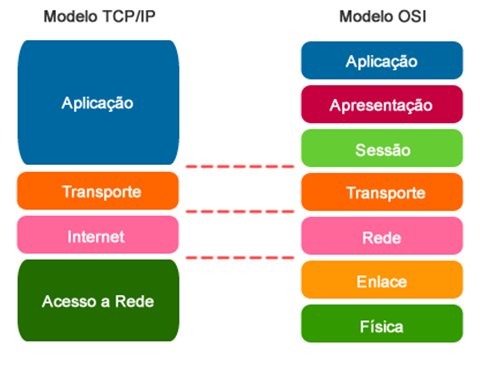
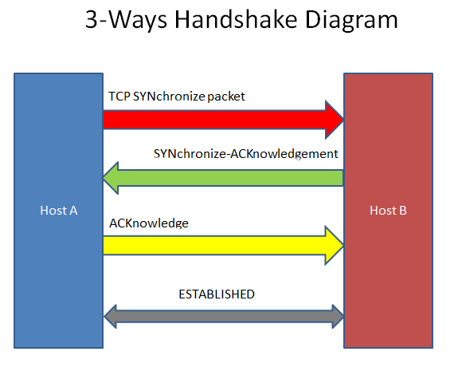
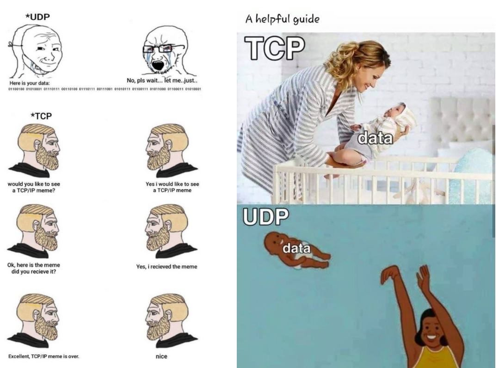
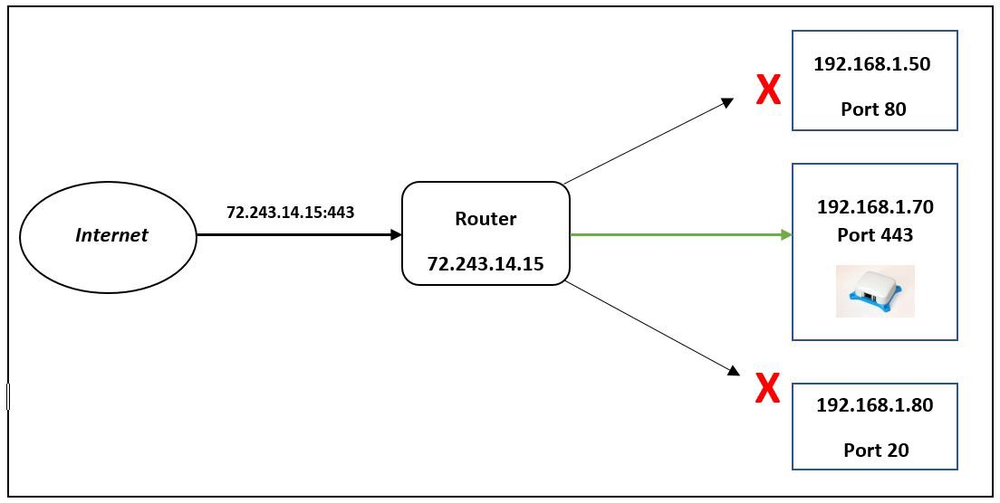
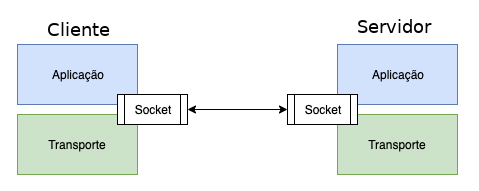

# Camada de Transporte

## MODELO-OSI / MODELO-TCP/IP

Para facilitar o entendimento dessa parte, é válido revisitarmos um conceito muito importante visto anteriormente, o MODELO-OSI:

Nessa etapa, estamos estudando a camada 4 \("Transporte"\). Esta é responsável pela transferência de dados entre máquinas, reunindo diversos protocolos, entre eles, os protocolos TCP e UDP, que serão vistos em seguida.

É válido ressaltar que existe uma simplificação desse famoso Modelo-OSI, conhecido como Modelo-TCP/IP. Basicamente o primeiro demonstra como realmente a comunicação entre computadores acontece, descrevendo minuciosamente todos os passos. Já o segundo, demonstra como funciona essa comunicação na prática. As diferenças entre eles podem ser observadas na seguinte imagem:

Não podemos nos confundir ao falar que o Modelo-TCP/IP possuem apenas 2 protocolos\("TCP" e "IP"\). Isso porquê na realidade, o Modelo é apenas uma simplificação de todos os processos que acontecem na comunicação, porém inúmeros protocolos podem participar de tal comunicação.

## PROTOCOLOS

### TCP

O protocolo **TCP** \("Transmission Control Protocol"\) é o protocolo mais importante da camada de transporte, pois é responsável por estabelecer uma conexão entre dois processos em dois hosts, verificando se os dados que foram enviados foram recebidos corretamente e sem erros. Tal característica, determina que o Protocolo TCP garante a **integridade** dos dados a partir de uma validação, conhecida como **"Checksum"**. Essa validação é basicamente uma conta matemática \(resultando em uma HASH\) que garante que tudo que foi recebido em um host foi exatamente o que foi enviado por outro host.

Outra característica muito importante de tal protocolo, é o requerimento de uma conexão **\("Connection Based"\)**. Isto é, uma determinada aplicação envia um pedido de conexão para o destino e usa a "conexão" para transferir dados.

Agora, descreveremos como acontece o estabelecimento de uma comunicação virtual conhecido como **"Three-Way Handshake"**, do inglês, aperto de mão em três vias:

Estabelecimento de conexões:

1. O cliente envia um pacote com a flag "SYN" ativa.
2. O servidor responde com um pacote com as flags "SYN" + "ACK".
3. O cliente responde com um pacote ACK.

$$
\textrm{CLIENTE: Servidor, quero me conectar com você! ("SYN")} \\~\\  \textrm{SERVIDOR: Com certeza, cliente. Só confirma pra mim com outra mensagem ("SYN" + "ACK")} \\~\\ \textrm{CLIENTE: Suave, estou enviando a mensagem de confirmação ("ACK")} \\~\\ \textrm{CONEXÃO ESTABELECIDA!}
$$

### UDP

O protocolo UDP \("User Datagram Protocol"\) também é um protocolo que pertence à Camada de Transporte e tem como a principal diferença do TCP a falta de confiabilidade dos dados recebidos por um determinado host.

A princípio, isso pode parecer meio confuso, "Como assim, eu estou usando um protocolo que não me garante que o que estou recebendo foi realmente o que foi enviado??" Primeiramente, devemos entender que isso ocorre justamente porque o UDP é mais leve que o próprio TCP, e para algumas aplicações isso pode ser bastante recomendado.

Imagine que você queira assistir um filme, e a primeira coisa que te vem a mente é colocar um netflix, ou qualquer outro serviço parecido. Já parou para pensar o quão grandes os arquivos de filmes podem ser? Imagina só se a cada pacote do seu filme, tivéssemos que verificar se os dados recebidos são completamente íntegros com os pacotes enviados. Seria muito massante não é mesmo? Seu filme teria grandes chances de ficar travando o tempo inteiro.

Então, ta aí a solução para o seu problema, o Protocolo UDP. O fato desse protocolo ser mais leve, garante que serviços de streaming funcionem da maneira esperada. Algumas características sobre esse protocolo:

1. **Não** é Connection Based, ou seja, não existe uma conexão
2. **Não** garante a integridade dos pacotes
3. **Não** garante nem que os pacotes cheguem até o destino

## PORTAS

Para facilitar o entendimento, é possível relacionar com um delivery qualquer. Digamos que o usuário residente em um **condomínio** peça uma pizza por um aplicativo de delivery. O restaurante precisa saber o endereço do usuário, no entanto só isso não basta. Como o cliente mora em um condomínio, o restaurante precisa saber o número do apartamento do cliente. Em analogia com a comunicação entre dispositivos, chamamos esse número de **porta.**

As portas são números de 16 bits que representam canais virtuais aleatórios definidos pelo sistema operacional. Esses canais fazem com que seja possível mapear cada processo em andamento no computador. Isso garante que o dispositivo que iniciou a comunicação encontre o processo desejado no IP. Por exemplo, o usuário faz uma requisição de uma página web \(por padrão, é a porta 80\) e, por causa da porta HTTP, o usuário recebe realmente uma página web, mesmo que existam outras aplicações rodando em sua máquina \(DNS, SSH ou FTP\). 

As portas são números de 16 bits que representam canais virtuais aleatórios definidos pelo sistema operacional. Esses canais fazem com que seja possível mapear cada processo em andamento no computador. Isso garante que o dispositivo que iniciou a comunicação encontre o processo desejado no IP do usuário. Por exemplo, o usuário faz uma requisição de uma página web HTTPS \(por padrão, é a porta 443\) e, por causa da porta do protocolo HTTPS, o usuário recebe realmente uma página web, mesmo que existam outras aplicações rodando em sua máquina \(DNS, SSH ou FTP\).

## SOCKET

O **socket** é o ponto final de uma comunicação. Do inglês "tomada", o socket faz a parte chave e fechadura da comunicação similar ao diagrama a baixo.

O socket é identificado por uma composição do endereço IP e de uma porta. Portanto, **uma conexão TCP é identificada por um par de sockets \(host1, port1\) e \(host2, port2\).** Com isso, conclui-se que é possível trocar dados entre dois processos \(portas\).

Em suma, **um socket conecta um processo a uma porta do computador.** A conexão cliente-servidor ocorre entre processos através de uma porta, que não necessariamente devem ser iguais.
