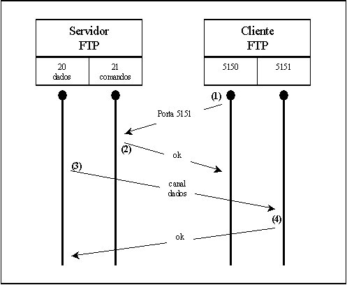
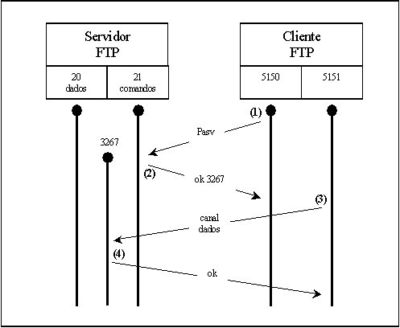

# FTP

**FTP** (File Transfer Protocol) é um protocolo de transferência de arquivos entre um cliente e um servidor que situa-se na camada de aplicação do modelo OSI.

O FTP foi desenvolvido em 1971 e foi criado para fornecer um método de transferência de arquivos seguro na ARPANET. Ao longo dos anos, o FTP foi sendo aprimorado, mas o ponto é que, por si só, é um protocolo antigo e cada vez está sendo menos adotado. Em janeiro de 2021, o Google Chrome parou de suportar o protocolo FTP ([veja mais](https://tecnoblog.net/303161/google-chrome-fim-suporte-ftp/)).

O FTP funciona juntamente com o protocolo TCP para garantir a entrega do arquivo com consistência. 

## Funcionamento

O servidor FTP usa duas portas, em específico, para estabelecer uma conexão com o cliente:

- **20**: porta ****utilizada para criar o canal de dados. Basicamente, é o canal onde os arquivos são enviados.
- **21**: porta utilizada para criar o canal de controle/comandos. Nela, informações como usuário, senha, inserção e deleção de arquivos e navegação do usuário são transmitidas.

O funcionamento do FTP se dá de dois modos referentes ao servidor: **ativo** e **passivo**.

### Ativo

A comunicação no **modo ativo** se dá nos seguintes passos:

1. O cliente a partir de uma porta x comunica-se com a porta 21 do servidor pelo canal de controle;
2. Cliente requisita um arquivo e informa a porta na qual deseja receber ele, no nosso caso, chamaremos de porta y;
3. O servidor a partir da porta 20 envia, de forma ativa, o arquivo para a porta y.

### Passivo

A comunicação no **modo passivo** se dá nos seguintes passos:

1. O cliente a partir de uma porta x comunica-se com a porta 21 do servidor pelo canal de controle, especificando que a comunicação se dará de modo passivo;
2. Servidor retorna uma mensagem para a porta x do cliente informando que a porta passiva do servidor será a porta y;
3. Caso o cliente deseje pegar um arquivo, ele vai até a porta y do servidor e pega o arquivo. 

## Adaptações

Como foi dito anteriormente, o FTP é um protocolo obsoleto, mas com algumas adaptações ele pode se tornar um protocolo ainda muito útil para os dias atuais e com uma boa segurança. Vamos ver duas dessas adaptações:

### FTPS

FTPS (File Transfer Protocol Secure) é basicamente um FTP só que com uma camada extra de segurança baseada em SSL/TLS (Secure Socket Layer / Transport Layer Security), que é nada mais que protocolos de segurança. O FTPS pode ser feito de dois modos: explicit e implicit.

- Explicit FTPS (ou FTPES): uma vez que a conexão é requisitada pelo cliente, antes do login, uma conexão SSL é feita na porta 21 e por ela é feita uma verificação para ver se o cliente tem as credenciais de segurança configuradas corretamente. Caso não tenha, é possível simplesmente impedir o prosseguimento da aplicação ou fazer ela de maneira insegura, com apenas as credencias de acesso protegidas.
- Implicit FTPS: uma verificação de segurança é feita separadamente na porta 990 e caso falhe, a conexão FTP simplesmente não ocorrerá.

### SFTP

SFTP (SSH File Transfer Protocol) é o FTP aplicado para o SSH (Secure Shell). Tanto o SFTP quanto o FTPS fornecem uma proteção a mais para o FTP. Apesar disso, o SSL/TLS utiliza-se (não precisa entender isso) de uma autoridade de certificação que garante uma comunicação ainda mais segura. No entanto, uma vantagem do SFTP é que é packet-based, ou seja, baseia-se em pacotes, deixando a comunicação mais rápida, em oposição ao FTP e ao FTPS, que é text-based. Similar ao VPN, aqui ocorre um tunelamento, em que o cliente se conecta com um servidor SSH para que daí ocorra a comunicação com o FTP, já que os dados ficarão seguros na comunicação SSH-FTP e FTP-SSH.

### TFTP

TFTP (Trivial File Transfer Protocol) é o FTP simplificado para dois hosts em uma mesma rede.

## Bibliografia

1. [https://meunegocio.uol.com.br/blog/ftp-ftps-e-sftp-o-que-sao-e-para-o-que-servem/#rmcl](https://meunegocio.uol.com.br/blog/ftp-ftps-e-sftp-o-que-sao-e-para-o-que-servem/#rmcl)
2. [https://memoria.rnp.br/newsgen/0011/ftp-passivo.html](https://memoria.rnp.br/newsgen/0011/ftp-passivo.html)
3. [https://exavault.medium.com/the-difference-between-ftp-ftps-and-sftp-5f80a33a7838](https://exavault.medium.com/the-difference-between-ftp-ftps-and-sftp-5f80a33a7838)
4. [https://www.ftptoday.com/blog/explicit-ftps-vs-implicit-ftps-what-you-need-to-know#:~:text=When using implicit FTPS%2C an,or file transfer can begin.&text=In these cases%2C port blocking,prevents explicit FTPS transfers%2C too](https://www.ftptoday.com/blog/explicit-ftps-vs-implicit-ftps-what-you-need-to-know#:~:text=When%20using%20implicit%20FTPS%2C%20an,or%20file%20transfer%20can%20begin.&text=In%20these%20cases%2C%20port%20blocking,prevents%20explicit%20FTPS%20transfers%2C%20too).
