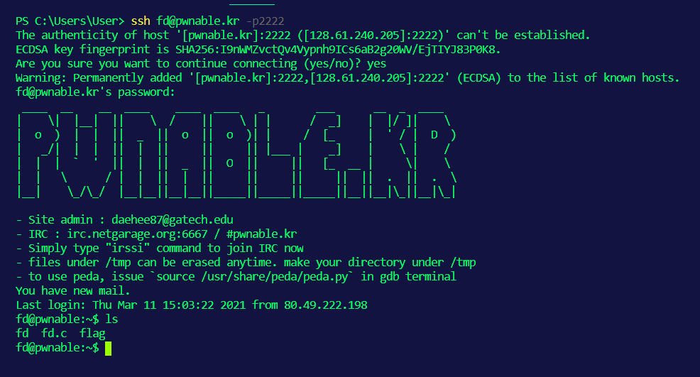

# SSH

O SSH (Secure Shell) foi criado por Tatu Ylonen no intuito de permitir o login remoto em uma rede insegura de forma segura. Quando foi criado, a rede era insegura devido a instalação de um sniffer que já havia capturado milhares de nomes de usuário e senhas no servidor.

Hoje em dia, o SSH é usado amplamente para que usuários possam acessar, administrar e modificar remotamente servidores de forma segura. Na frente de Redes e Pentest, usamos com muita frequência o SSH para obter acesso a servidores.

O acesso ao SSH normalmente se dá na porta 22.

## Shell

O acesso ao servidores por meio do SSH se dá por meio de uma shell, que é basicamente uma entrada para o usuário acessar os serviços do sistema operacional. Na maioria dos casos, teremos um terminal rodando uma shell, ou seja, o terminal será a interface no qual colocaremos nossa entrada que será processada pela shell para acessar os serviços do SO.

## Acesso

Para acessar um computador usando SSH, use o seguinte comando:

```bash
ssh {user}@{host} -p {port}
```

- **user**: é a conta com a qual você vai ter acesso ao computador remoto
- **host**: é o computador que você vai se conectar. Pode ser o nome do domínio ou o endereço IP, por exemplo.
- **-p {port}**: parâmetro opcional. Usado para especificar a partir de qual porta do próprio computador, será feita a conexão.

Exemplo:


