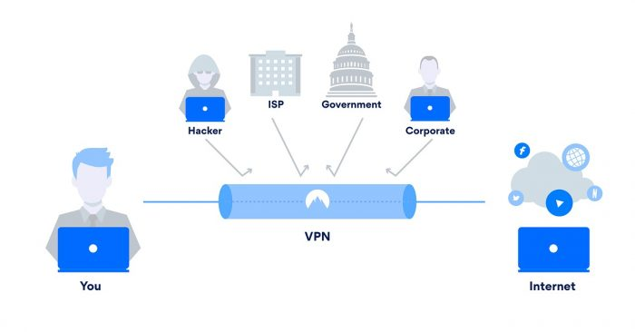

# VPN

> **Virtual Private Network ou Rede Virtual Privada**

### Sem VPN

- Quando fazemos uma requisição na internet convencional, estamos nos comunicando com nosso provedor de serviço de internet (Internet Service Provider - ISP)
- O ISP lida com nossas requisições, buscando comunicação da nossa máquina com toda a internet, e é responsável por atribuir a nossa máquina (computador, tablet, smartphone) um endereço IP único, que é utilizado para ser identificado pelo site e pela rede pública
- A requisição sai da nossa máquina e acessa o servidor pelo qual estamos buscando. Desta forma, existe uma exposição dos nossos dados, além de que nossas atividades são relacionados a nosso IP único.

### Com VPN

- Ao conectar com a internet utilizando uma VPN, é realizada uma conexão segura com um servidor VPN, a partir de um tunelamento criptografado em que apenas o cliente e o servidor final desta VPN possuem chaves para decriptação dos dados.
- O tráfego de dados e o registro de atividades continuam passando pelo provedor de internet (ISP), mas o mesmo não consegue lê-los ou ver o destino das requisições, uma vez que existe uma criptografia sobre eles.
- Os sites visitados não são capazes de identificar o endereço IP original, fornecido pelo seu provedor, uma vez que nosso endereço IP é encoberto pelo **IP do servidor da VPN**, que é compartilhado por todos os outros usuários do serviço.

Tópicos importantes para o entendimento de uma VPN

### Proxying

Proxy consiste em um servidor que age como intermediário entre as requisições de um cliente e a outros servidores. O cliente realiza uma solicitação ao proxy de algum conteúdo ou recurso na internet, e por sua vez o proxy avalia a requisição, procurando fazer um controle, simplificação da solicitação e encaminhamento das requisições para a internet. 

O servidor VPN age como um **proxy** para a atividade do cliente na internet, uma vez que as requisições realizas não saem diretamente do IP da máquina do cliente, mas sim são recolhidas e encaminhadas a partir do servidor VPN, garantindo anonimidade na internet, escondendo a localização do cliente original e seu endereço IP

### Autentificação

Existe uma relação de autenticação que garante ao cliente que sua comunicação é restrita ao servidor VPN e o mesmo ocorre no caminho contrário: troca de chaves e criptografia são utilizados para garantir que o tunelamento é seguro e está sendo realizado de fato entre as duas pontas corretas do VPN

 

### Tunelamento

O tunelamento pode ser enxergado como uma via pelo qual trafega os dados do cliente para o servidor VPN e vice versa, sendo que os pacotes são criptografados e encapsulados, sendo que apenas as duas pontas do túnel possuem as chaves correspondentes para a decriptação e leitura dos dados. Desta maneira, a leitura de terceiros e ataques são impossibilitados. 

### Referências:

[What is a VPN and How Does it Work? [Video Explainer]](https://www.youtube.com/watch?v=_wQTRMBAvzg)

[O que é VPN - Saiba como funciona uma VPN | ExpressVPN](https://www.expressvpn.com/pt/what-is-vpn)

[O que é uma VPN e como funciona?](https://www.kaspersky.com.br/resource-center/definitions/what-is-a-vpn)
